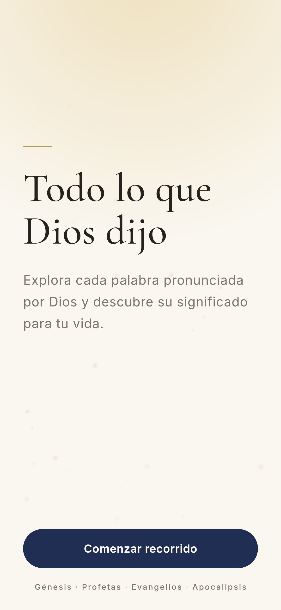
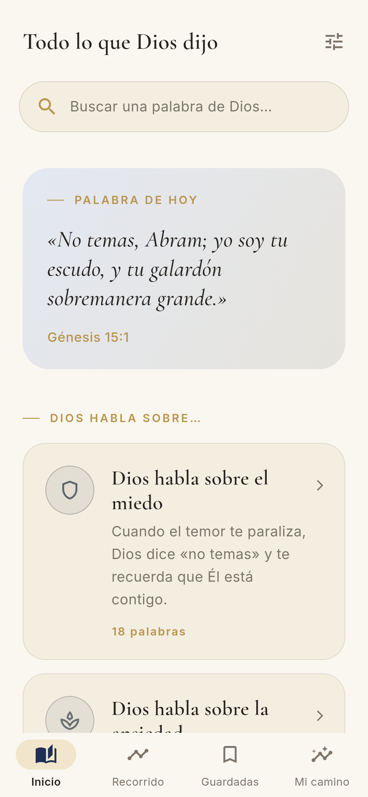
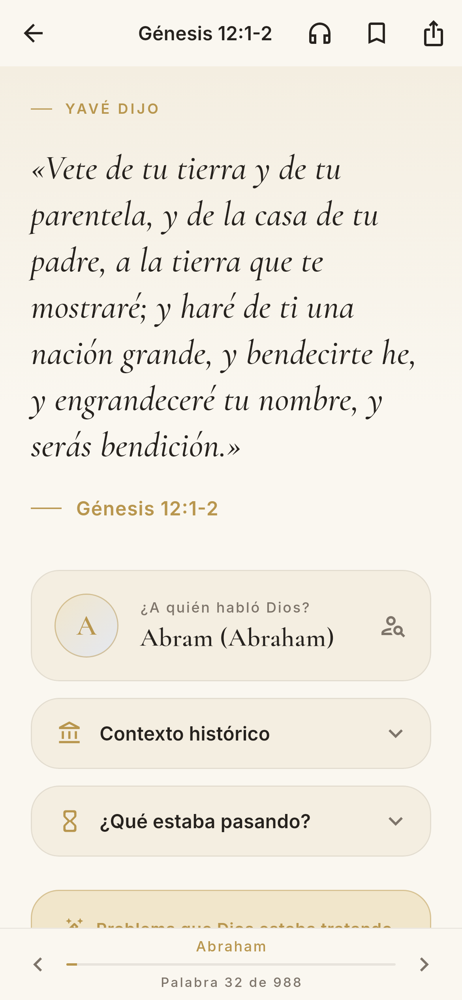
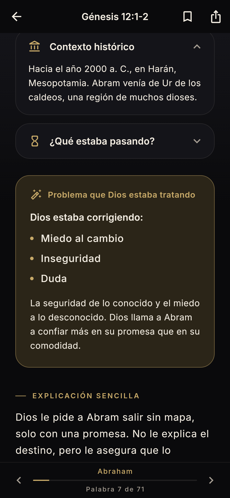
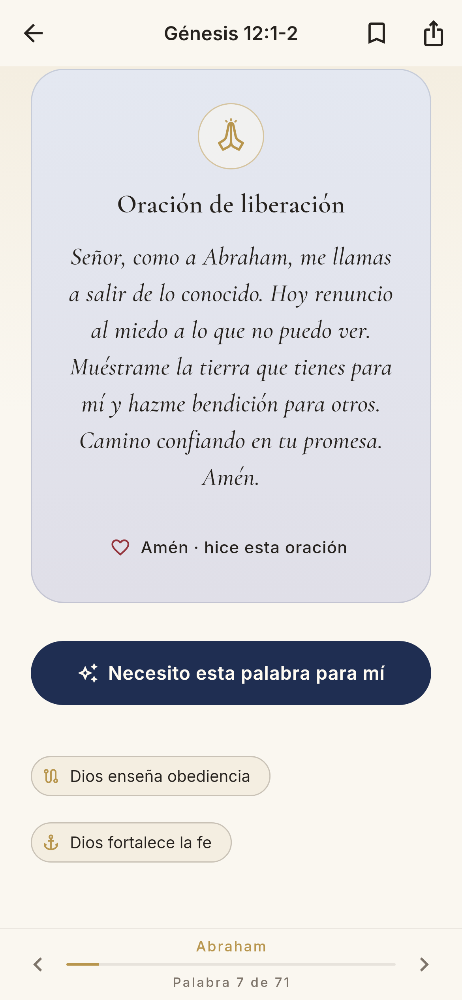

# Todo lo que Dios Dijo

Aplicación Android (Flutter + Firebase + Material Design 3) que reúne, en orden
cronológico, los pasajes bíblicos donde **Dios habla directamente**: de «Sea la luz»
(Génesis 1:3) a «Ciertamente, vengo en breve» (Apocalipsis 22:20).

<p>
  
  
  
  
  
</p>

## Qué incluye

**960 palabras de Dios** en orden cronológico, en 12 etapas (Adán, Noé, Abraham, Isaac,
Jacob, Moisés, Josué, Profetas, Israel, Evangelios, La Iglesia, Apocalipsis):

- **Cada lugar del Antiguo Testamento donde Yavé habla directamente**, extraído del
  texto completo de la RV1909: todos los «Así dice/ha dicho Yavé», «dice Yavé»,
  «Y dijo Yavé…», «fue palabra de Yavé a…», toda la Ley dada a Moisés, la respuesta a
  Job desde el torbellino, los Salmos donde Dios habla, etc. (`tool/corpus/extract.py`).
- **Cada pasaje sobre «la voz de Yavé»** (categoría propia).
- **Palabra al azar** (inicio, lectura, recorrido, cada tema y tus guardadas) y
  **escucha en orden aleatorio** con el botón 🔀, que recuerda el orden y dónde te quedaste.
- **Las 960 palabras explicadas a mano** (incluidas las del Nuevo Testamento: la voz del
  Padre y palabras de Jesús). De cada pasaje se muestra solo lo que Dios dijo, corto y
  preciso, palabra por palabra de la RV1909.

Cada una tiene: 1. Lo que Dios dijo · 2. Referencia · 3. A quién habló · 4. Contexto
histórico (por libro) · 5. Qué estaba pasando (por capítulo) · 6. Problema que Dios
estaba tratando · 7. Explicación sencilla · 8. Aplicación para hoy · 9. Oración.
Los apartados 6–9 están escritos a mano en todas las palabras (`tool/content/written/`),
y «Necesito esta palabra para mí» ofrece además una reflexión personalizada.

**Texto bíblico**: Reina-Valera 1909 completa (dominio público, heredera de la *Biblia
del Oso* de Casiodoro de Reina, 1569) con ortografía actualizada y el nombre divino
**Yavé**. Fuente: `tool/corpus/source/`.
Las traducciones que usan «Yavé/Yahvé» de forma nativa (Nácar-Colunga, Biblia de
Jerusalén, Biblia Latinoamericana) tienen derechos vigentes: para usarlas hace falta
licencia de la editorial. El contenido se puede reemplazar por Firestore sin publicar
una nueva versión.

| Función | Dónde |
|---|---|
| Pantalla de bienvenida con luz suave y partículas | `features/welcome` |
| Tarjetas «Dios habla sobre…» (10 categorías) | `features/home` |
| Lectura tipo pergamino, deslizar = avanzar cronológicamente | `features/passage` |
| «Necesito esta palabra para mí» (IA con Gemini + respaldo offline) | `domain/personalization` |
| Recorrido de la Voz de Dios (línea de tiempo) | `features/journey` |
| Escuchar las palabras seguidas (en orden o al azar) en voz alta, con oración; recuerda dónde te quedaste | `features/listen`, `domain/listening` |
| Repetir una palabra una y otra vez (completa o solo lo que Dios dijo) | `features/listen`, `domain/listening` |
| Escuchar los resultados de una búsqueda, uno tras otro | `features/search`, `domain/listening` |
| Voz de Dios inconfundible: anuncio «Escucha. Habla Yavé», campana, voz más grave y pausada, tarjeta dorada y elección de voz | `features/listen`, `domain/listening`, `assets/audio` |
| Versículos completos (toda la conversación, nunca a medias): el narrador cuenta, la campana suena cada vez que Dios habla y habla con su voz («Voz 2» por defecto); modo «Solo la Palabra» sin explicación | `tool/corpus/segment.py`, `shared/widgets/verses_text.dart`, `domain/listening` |
| Tu voz: de fábrica las voces tienen el tono de la voz de referencia; «Parecida a mi voz» graba 10 s: el narrador habla con tu tono y Dios con tu misma voz, más grave; controles de tono, velocidad y voz del narrador | `domain/listening/pitch.dart`, `domain/listening/voice_sampler.dart`, `features/listen` |
| Edición «Jehová» (otra app): solo el Antiguo Testamento (937 palabras), con el nombre «Jehová», en azul y blanco | `lib/core/config/edition.dart`, `assets/data/content_jehova.json`, sabor `jehova` |
| Edición «Jesús» (otra app): todo lo que dijo Jesús, de Mateo a Apocalipsis (344 pasajes, 2396 versículos de la RV1909), con su voz separada de la narración dentro de cada versículo, en dorado y verde | `tool/jesus/build_jesus.py`, `assets/data/content_jesus.json`, sabor `jesus` |
| Escuchar de fondo: sigue con la pantalla apagada o en otra app (servicio de reproducción con notificación y controles en la pantalla de bloqueo); se pausa en las llamadas y sigue al colgar; se pausa al desconectar los auriculares | `domain/listening/background_audio.dart`, `domain/listening/listening_background.dart` |
| Búsqueda inteligente: palabra, problema, tema, personaje | `domain/search`, `features/search` |
| Las palabras que guardé (versículo + aplicación + oración) | `features/favorites` |
| Mi camino: leídas, días seguidos, temas, oraciones | `features/stats` |
| Compartir, modo oscuro, tamaño de letra | `features/passage`, `features/settings` |
| Lectura offline | `assets/data/content.json` + caché |

## Arquitectura

```
lib/
├── app/            App, enrutador (go_router), shell de navegación, providers (Riverpod)
├── core/           Tema (paleta marfil/dorado/azul/gris cálido), configuración, analíticas
├── data/           Modelos, fuentes (asset local, caché, Firestore) y repositorios
├── domain/         Motor de búsqueda y servicio de personalización (IA / offline)
├── features/       Una carpeta por pantalla
└── shared/widgets  Fondo sagrado, apariciones suaves, destello dorado, manos orando…
```

- **Offline-first**: el contenido va empaquetado en la app. Al abrir, se consulta
  Firestore (`content/current`) en segundo plano; si hay una `version` mayor se guarda
  en caché y se usa desde entonces.
- **Firebase opcional**: sin configuración la app funciona completa (sin IA remota,
  sin analíticas). Con `flutterfire configure` se activan Firestore, AI Logic, App Check,
  Analytics y Crashlytics.
- **Búsqueda local**: normaliza tildes, entiende sinónimos («estrés» → ansiedad),
  prefijos, errores de escritura y frases completas («tengo miedo al futuro»).
- **IA responsable**: respuesta en JSON con esquema, instrucciones pastorales,
  aviso de IA, y recursos de ayuda automáticos ante señales de crisis.

## Desarrollo

```bash
flutter pub get
flutter run                 # emulador o dispositivo Android (edición completa)
flutter run --flavor jehova # edición «Jehová»: solo Antiguo Testamento, azul y blanco
flutter run --flavor jesus  # edición «Jesús»: todas las palabras de Jesús, dorado y verde
flutter analyze && flutter test
```

- Contenido: `python3 tool/corpus/extract.py && python3 tool/build_content.py` → `assets/data/content.json` (ver `tool/content/README.md`).
- Iconos: `flutter test tool/icon/generate_icons_test.dart`.
- Capturas: `flutter test test/screenshots --update-goldens --run-skipped`.
- CI: `.github/workflows/android.yml` analiza, prueba y genera APK y AAB como artefactos.

Publicación en Google Play: [docs/PUBLICACION_GOOGLE_PLAY.md](docs/PUBLICACION_GOOGLE_PLAY.md) ·
Privacidad: [docs/PRIVACIDAD.md](docs/PRIVACIDAD.md)
